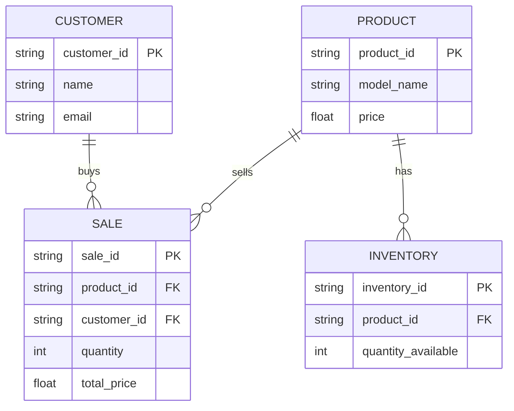

# Ilya-xp.github.io

#Relationship Description

* The customer is a consumer with identification.
* The customer has a relationship with the sale. Both are connected by the purchase of shoes.
	* This is significant because it shows who is the customer and what they are buying.
* The sale is a record of the customer buying the product. 
* The sale has a relationship with the product. They are connected by showing the product sold. 
	* This is significant because it shows the product and its price. 
* The product is shoes that are being sold.
* The product has a relationship with inventory. Both are connected by the shoes. 
	*This is significant because it shows what shoes are being purchased.
* The inventory is a stock of shoe models.
* The inventory has a relationship with the product. They are connected by the shoe model.
	* This is significant because it shows what shoe models need restocking. 

 